# Learn With Hamster 🐹

> A modern online learning platform where you browse courses, track your progress, earn certificates, and actually feel good about finishing something.

Built as a full-stack microservices application — the kind of thing you'd expect from a production SaaS, but open-source and yours to run.

---

## What Is This?

Learn With Hamster is a **Udemy-style course platform** with a real backend. You can:

- Browse a catalogue of disciplines, courses, and lessons
- Enroll in courses (free or paid)
- Watch videos, read tutorials, and track your progress lesson by lesson
- Earn a downloadable PDF **certificate of completion** when you finish a course
- Bookmark lessons, take private notes, and navigate with keyboard shortcuts
- Add paid courses to a cart and check out

It's built on **JHipster 8.11.0** — a framework that generates production-ready Spring Boot + Angular applications — and structured as two independent microservices that talk to each other via Consul service discovery.

> This is a modernized rebuild of the [Armory project](https://github.com/ElectronicArmory/Armory) by Mike Ziray (Electronic Armory), upgraded from JHipster 4.x → 8.11.0, Angular 2 → 19, Gradle → Maven, and JHipster Registry → Consul.

---

## Screenshots

### Landing Page (logged out)
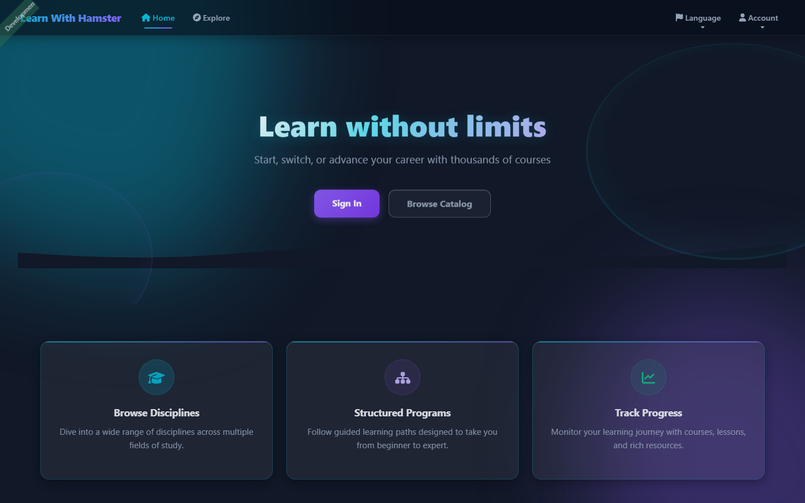

### Personalized Dashboard (logged in)
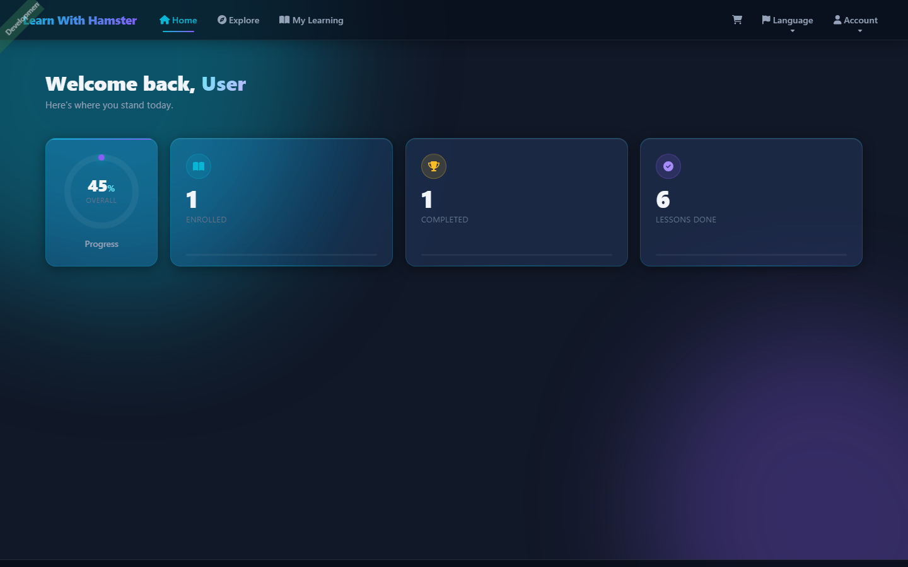

### Browse the Catalogue
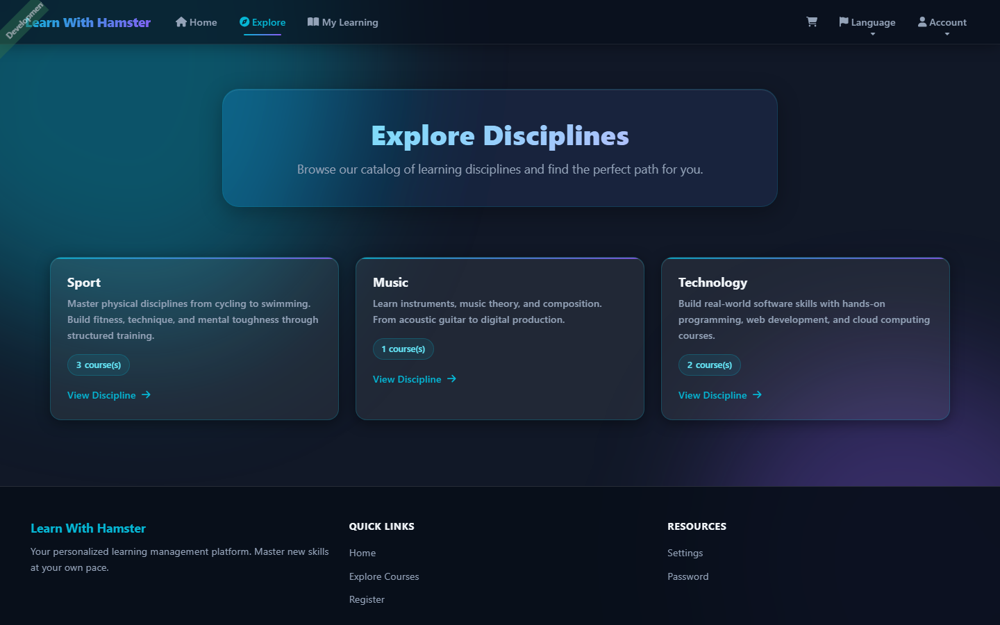

### Discipline Detail
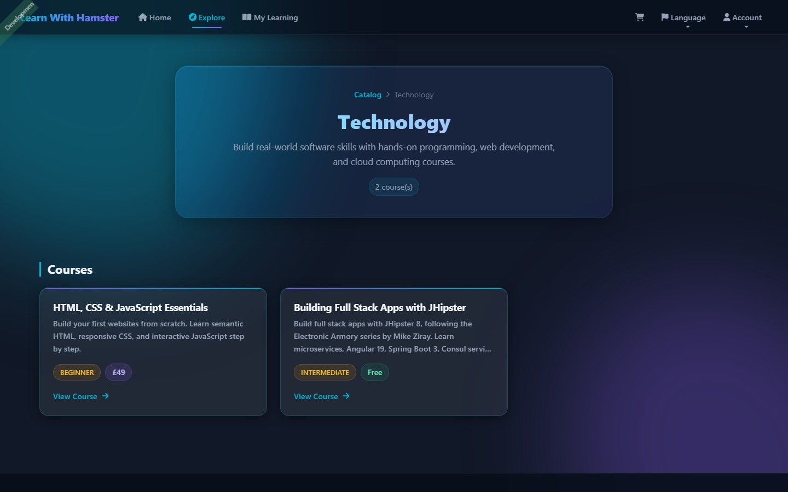

### Course Page (full curriculum)
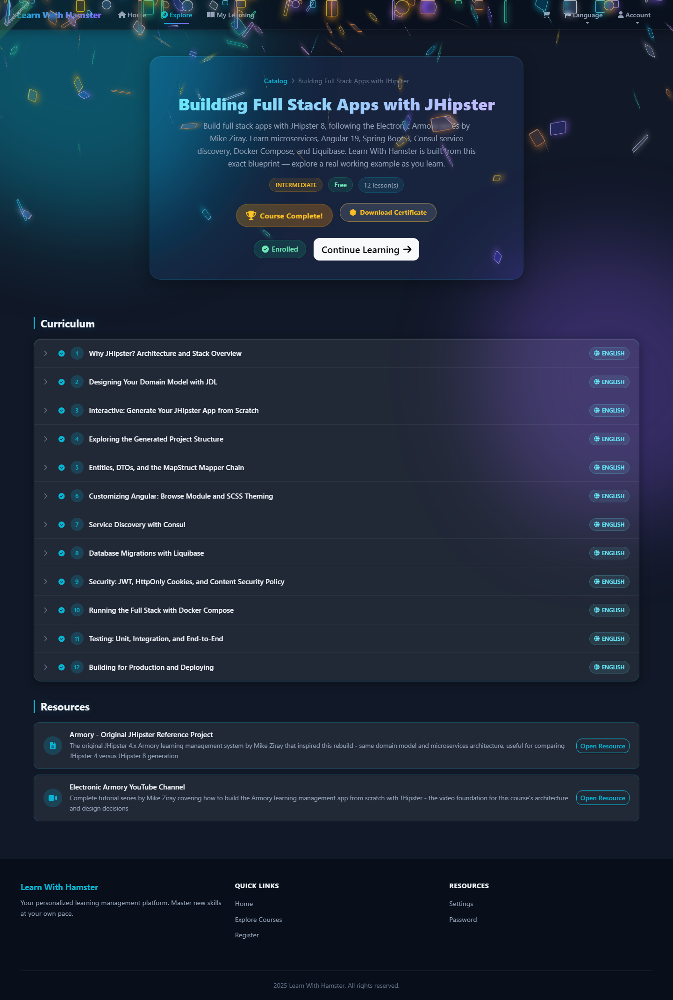

### Lesson Viewer
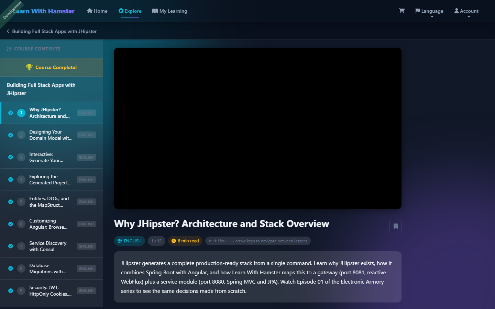

### My Learning Dashboard
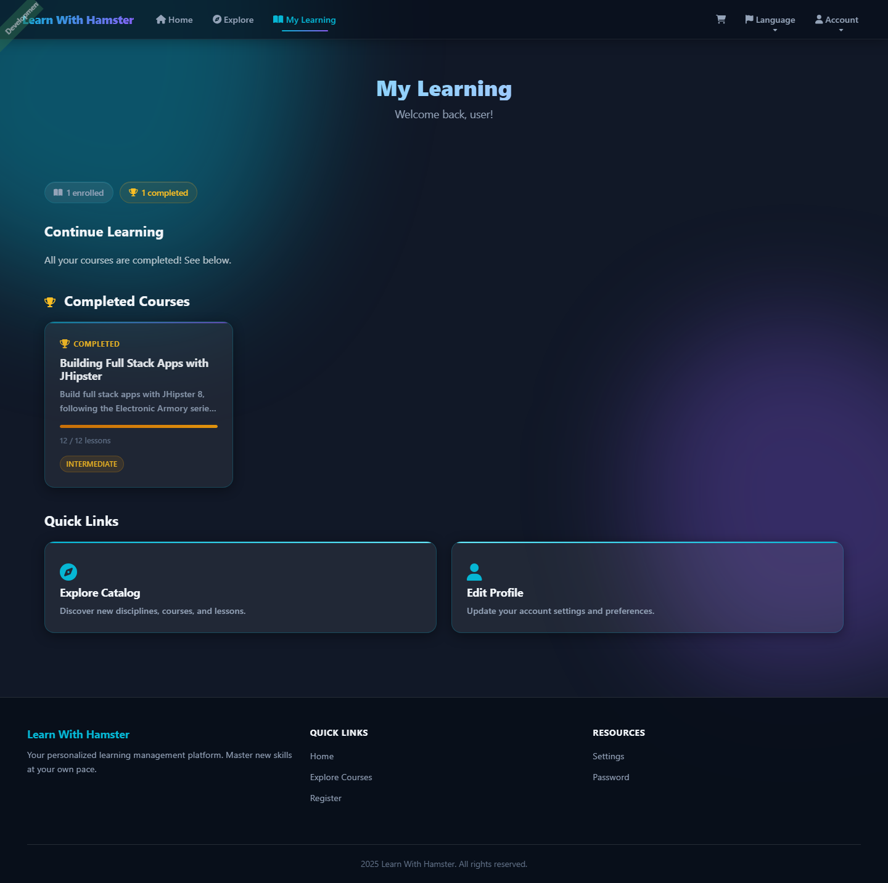

### Cart & Admin View
| Shopping Cart | Admin Dashboard |
|---|---|
| 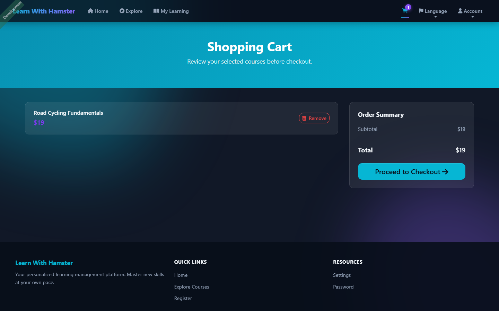 | 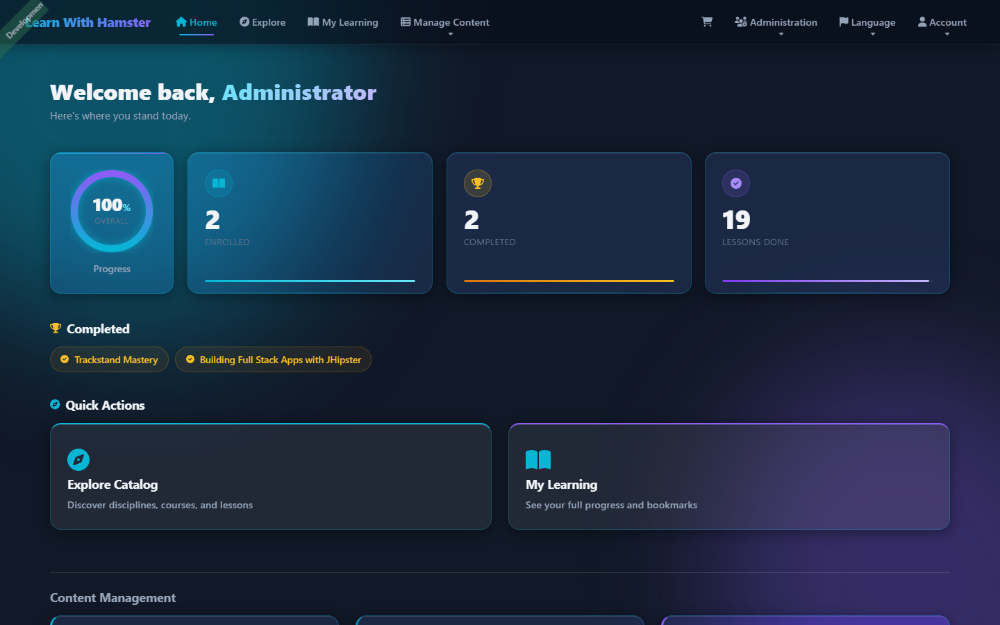 |

### Mobile Responsive
| Mobile Catalog | Mobile Dashboard |
|---|---|
| 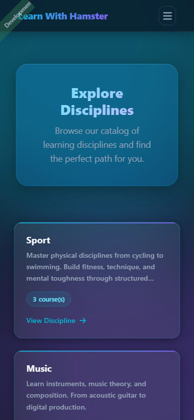 | 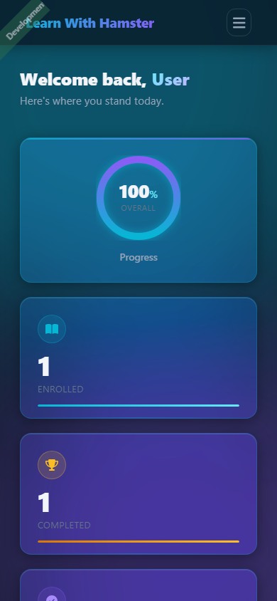 |

---

## How It's Built

The system has two independently deployable backend services plus a React-style Angular frontend.

### High-Level Architecture

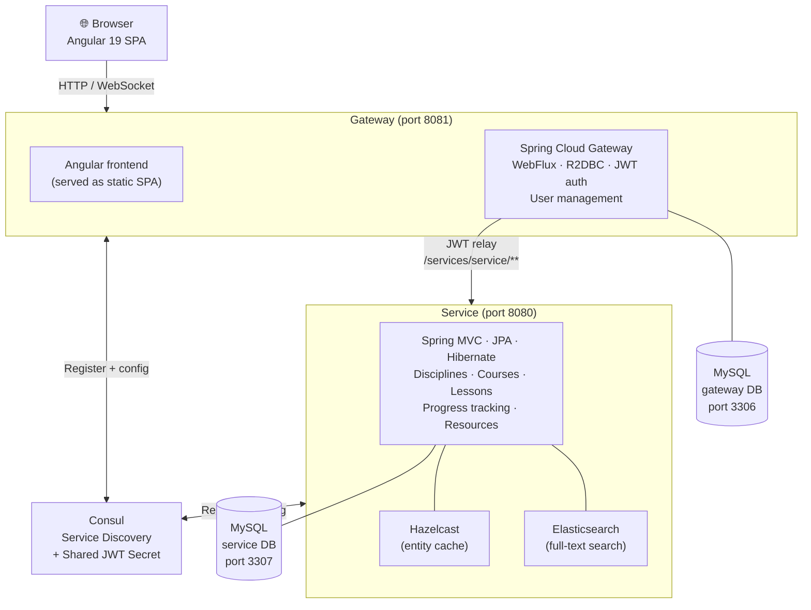

### What Each Part Does

| Part | Responsibility |
|---|---|
| **Gateway** | Serves the Angular SPA, handles login/JWT, routes API calls to the Service, manages user accounts |
| **Service** | Owns all course content (disciplines → courses → lessons), progress tracking, resources |
| **Consul** | Lets the Gateway find the Service by name instead of hardcoded URLs; also distributes the shared JWT secret |
| **MySQL (×2)** | Separate databases — one per service — so they can be scaled or moved independently |
| **Elasticsearch** | Powers the admin search interface for finding entities quickly |

### Content Structure

Everything in the platform hangs off a four-level hierarchy:

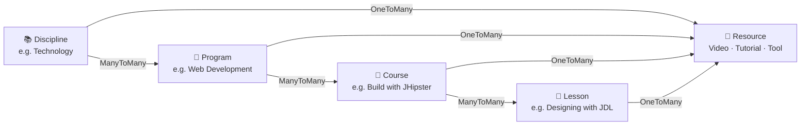

Each level can have **Resources** attached — videos, images, tutorials, or tool links.

---

## Getting the App Running

### What You Need First

- **Java 17+** (JDK 17, 21, or 24 all work)
- **Node.js 22.15.0+**
- **Docker & Docker Compose** (for the databases and Consul)
- **Maven 3.2.5+**

### Step 1 — Start the infrastructure

Docker handles Consul, both MySQL databases, and Elasticsearch:

```bash
docker compose up -d
```

You should see four containers come up: `consul`, `mysql-gateway`, `mysql-service`, and `elasticsearch`.

### Step 2 — Start the Service

The service owns all the course content. It runs on port 8080:

```bash
cd service
./mvnw
```

First run takes a minute because Liquibase sets up the database and loads sample data. You'll see `Started ServiceApp` in the logs when it's ready.

### Step 3 — Start the Gateway

The gateway serves the Angular frontend and handles authentication. It runs on port 8081:

```bash
cd gateway
./mvnw
```

### Step 4 — Open the App

- **App**: http://localhost:8081
- **Admin account**: `admin` / `admin`
- **Regular user**: `user` / `user`

### Frontend Dev Mode (with hot reload)

If you're working on the Angular frontend, start the dev server separately instead of rebuilding through Maven:

```bash
cd gateway
npm start       # serves on port 4200, proxies API to port 8081
```

---

## What You Can Do in the App

### If you're just browsing (no login needed on the Angular side)

The entire course catalogue is visible to anyone. You'll be prompted to log in before the API returns data, but the routes are open.

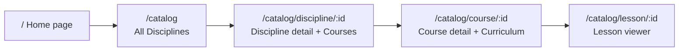

**On the lesson page** you get:
- The lesson content and all its resources (videos, tutorials, tools)
- **My Notes** — a private textarea that auto-saves to your browser
- **Bookmarks** — save any lesson to revisit from your dashboard
- **Keyboard navigation** — press `←` `→` to jump between lessons without touching the mouse
- **Reading time estimate** — calculated from word count and video resources
- **Progress tracking** — your visit is automatically recorded the moment you open a lesson

### When you're logged in

**Home dashboard** (`/`) — your personal progress at a glance:
- Animated stat cards that count up from zero when the page loads (enrolled, completed, lessons done, overall %)
- An SVG progress ring showing your overall completion across all courses
- A "Continue Learning" section with your in-progress courses and live progress bars
- Your completed courses shown as gold chips — click any to revisit

**Course page** — you'll see:
- A progress bar showing how many lessons you've completed
- Green checkmarks next to finished lessons
- "Enroll" for free courses or "Add to Cart" for paid ones
- A gold trophy + **Download Certificate** button when you've finished every lesson — triggers a full confetti celebration (screen flash, body shake, 7 burst waves, glassmorphism particles that settle on the floor)

**My Learning dashboard** (`/my-learning`):
- Stats showing how many courses you're enrolled in, in-progress, completed, and bookmarked
- Your in-progress courses with progress bars — click any to jump back in
- Your completed courses highlighted in gold
- Your bookmarked lessons with direct links

**Cart & Checkout** (`/cart` → `/checkout`):
- Add paid courses to your cart (stored in the browser, no server round-trip)
- Checkout enrolls you in all cart items in one API call
- Cart icon in the navbar shows the item count
- Clear error message shown if enrollment fails so you're never left guessing

### For admins only

The `/discipline`, `/course`, `/lesson`, `/resource`, and `/program` routes give you full CRUD management with pagination, sorting, search, and relationship pickers. These routes require `ROLE_ADMIN`.

---

## Sample Data

The dev profile loads a realistic hierarchy of content so you can explore immediately:

```
📚 Sport (free)
├── 🚴 Cycling
│   ├── Trackstand Mastery         free · Beginner   · 7 lessons
│   └── Road Cycling Fundamentals  $19  · Novice     · 4 lessons
└── 🏊 Swimming
    └── Intro to Freestyle Swimming $29  · Beginner   · 3 lessons

📚 Music ($49)
└── 🎸 Guitar Fundamentals
    └── Acoustic Guitar for Beginners $25 · Novice   · 5 lessons

📚 Technology ($99)
└── 💻 Web Development
    ├── HTML, CSS & JS Essentials  $49  · Beginner     · 5 lessons
    └── Build Full Stack Apps with JHipster
                                   free · Intermediate · 12 lessons
        Includes: JDL design, Consul, Liquibase, security,
        Docker, testing, production deployment
```

Resources include YouTube embeds, official docs, tool links, and links to this project's own GitHub repo. The JHipster course has a full **interactive tutorial** resource that renders as a step-by-step card with a "Start Tutorial" CTA.

To reset everything back to the sample data:

```bash
cd service
./mvnw clean spring-boot:run
```

---

## How Requests Flow

### Viewing a Course (end-to-end)

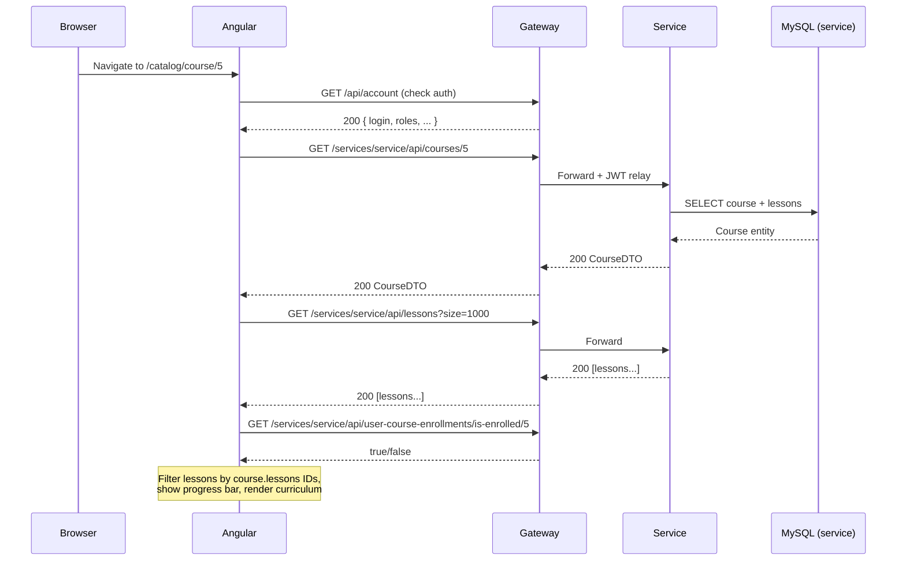

### Completing a Course (certificates + confetti)

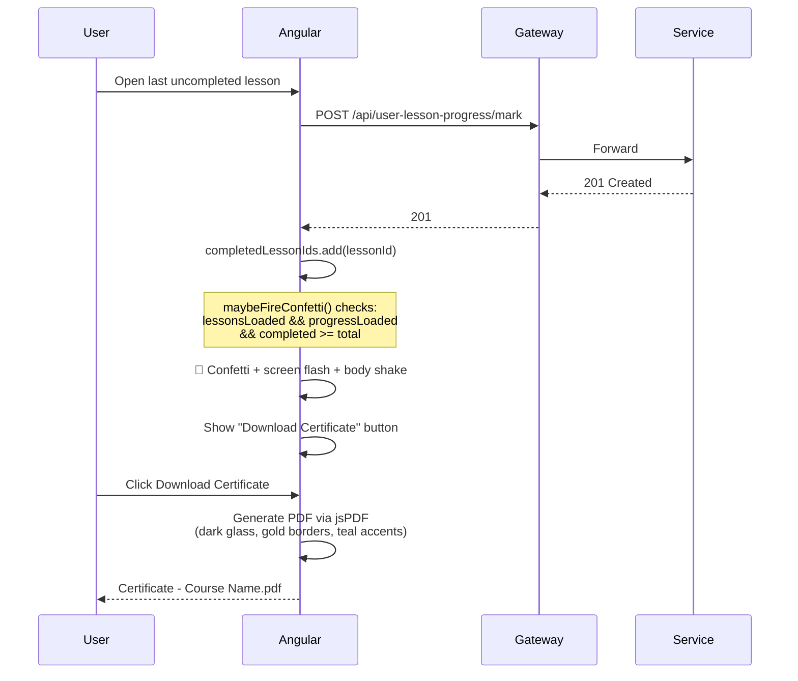

### Home Dashboard (animated stats on load)

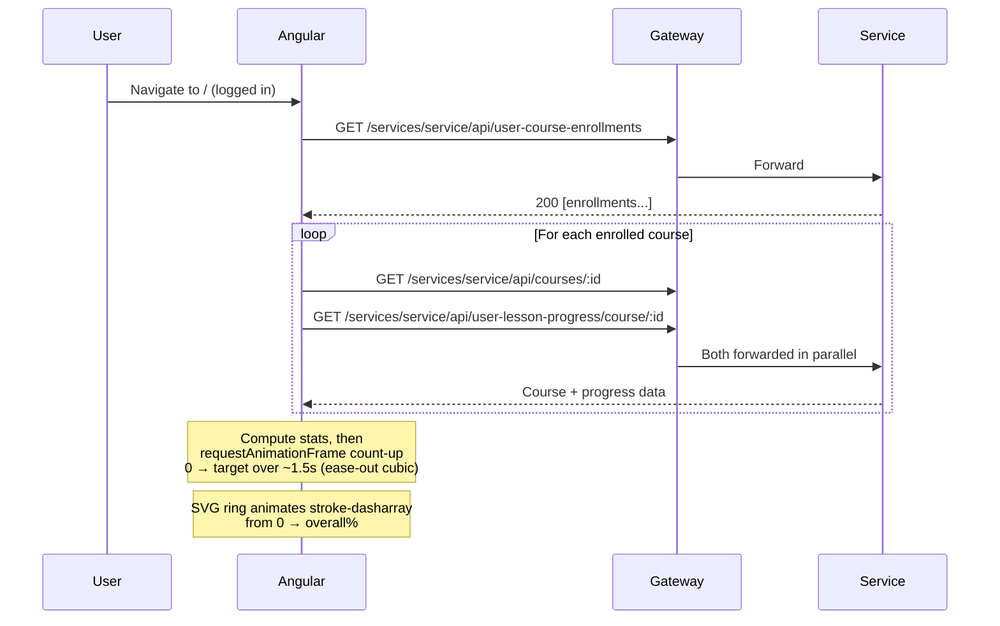

### Login Flow

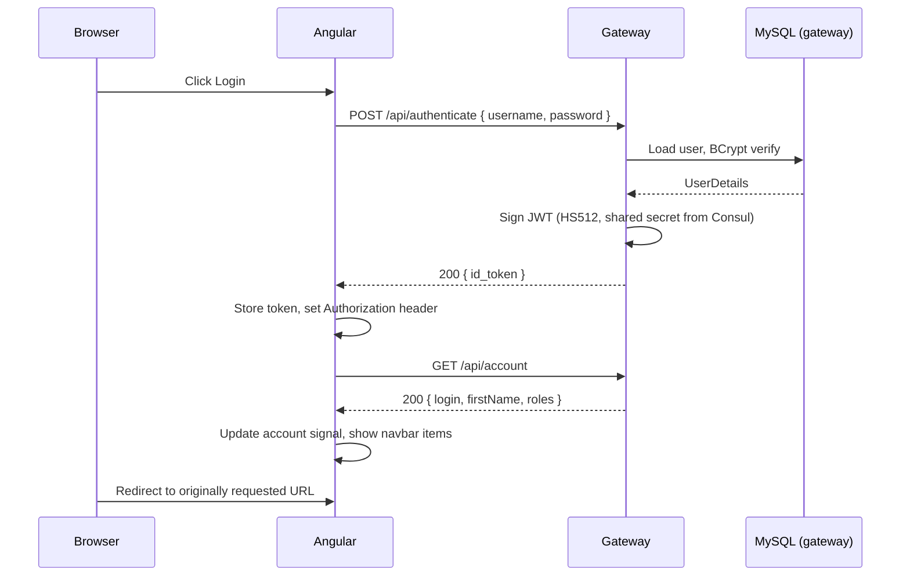

---

## Running Tests

```bash
# Frontend (Angular, Jest)
cd gateway
npm test            # Jest + ESLint
npm run jest        # Jest only, faster

# Gateway backend (Spring Boot + Testcontainers)
cd gateway
./mvnw test         # unit tests
./mvnw verify       # unit + integration tests (needs Docker)

# Service backend
cd service
./mvnw test
./mvnw verify
```

Integration tests spin up real MySQL containers via Testcontainers — Docker must be running.

### What the Frontend Tests Cover

| Spec file | What it tests |
|---|---|
| `bookmark.service.spec.ts` | localStorage bookmark persistence, toggle, multi-bookmark, corrupt data recovery |
| `lesson-browse.component.spec.ts` | Auth state, notes (save/load/overwrite), reading time, bookmarks, keyboard navigation (arrows, edge cases, input guard), resource action labels |
| `my-learning.component.spec.ts` | Enrollment loading, in-progress/completed computed split, bookmark loading, null-body resilience |
| `catalog.component.spec.ts` | Component creation, auth state |
| `course-browse.component.spec.ts` | Component creation, auth state |

---

## Project Layout

```
Learn-With-Hamster-App/
│
├── gateway/                          # API Gateway + Angular frontend
│   └── src/main/
│       ├── java/                     # Spring Boot (WebFlux, reactive)
│       │   └── .../config/           # Security, Consul, CORS
│       └── webapp/app/
│           ├── browse/               # Public course catalogue
│           │   ├── catalog/          # Discipline grid
│           │   ├── discipline/       # Discipline detail page
│           │   ├── course/           # Course page + curriculum + certificate
│           │   ├── lesson/           # Lesson viewer (notes, bookmarks, keyboard nav)
│           │   ├── bookmark.service.ts      # localStorage bookmark manager
│           │   ├── confetti.service.ts      # Completion celebration
│           │   └── certificate.service.ts   # PDF certificate generator
│           ├── my-learning/          # Personal dashboard
│           ├── cart/                 # Cart, checkout, confirmation
│           ├── entities/             # Admin CRUD pages + progress service
│           ├── home/                 # Landing page
│           └── layouts/navbar/       # Navigation bar
│
├── service/                          # Domain microservice (non-reactive)
│   └── src/main/
│       ├── java/                     # Spring MVC, JPA, Elasticsearch
│       └── resources/config/liquibase/
│           ├── changelog/            # Database migration scripts
│           └── fake-data/            # Sample data CSVs (dev profile)
│
├── docker/
│   └── central-server-config/
│       └── application.yml           # Shared JWT secret (picked up by Consul)
│
├── docker-compose.yml                # Start everything: Consul, MySQL×2, Elasticsearch
├── app.jdl                           # Full domain model definition
└── CLAUDE.md                         # Notes for AI assistants
```

---

## Tech Stack

| What | How |
|---|---|
| Frontend | Angular 19 · Bootstrap 5 · FontAwesome · ngx-translate · signal-based state |
| Gateway | Spring Boot 3 · Spring Cloud Gateway · WebFlux · R2DBC (reactive) |
| Service | Spring Boot 3 · Spring MVC · JPA/Hibernate · Hazelcast cache |
| Auth | JWT (HS512) · HttpOnly cookie · shared secret via Consul |
| Databases | MySQL (production) · H2 file-based (development) |
| Search | Elasticsearch (admin entity search) |
| Service Discovery | Consul |
| Build | Maven · webpack · Liquibase migrations |
| Testing | Jest · Cypress · JUnit 5 · Testcontainers |
| PDF generation | jsPDF (browser-side, no server) |
| Celebrations | canvas-confetti (7-wave burst, screen flash, body shake) + DOM glassmorphism particles |
| Animations | Web Animations API · requestAnimationFrame count-up · SVG stroke-dasharray transitions |

---

## Key Configuration Files

| File | What it controls |
|---|---|
| `app.jdl` | The entire domain model — entities, relationships, enums, app settings |
| `docker-compose.yml` | Which infrastructure services to run and how |
| `docker/central-server-config/application.yml` | The JWT secret shared between gateway and service |
| `gateway/src/main/webapp/app/app.routes.ts` | All Angular routes and their auth guards |
| `gateway/src/main/resources/config/application.yml` | Gateway Spring config (CSP headers, CORS, Consul) |
| `service/src/main/resources/config/liquibase/master.xml` | Database migration entry point |

---

## Detailed Flow Diagrams

For deep-dives into specific flows, see the `.drawio` files in `docs/diagrams/`:

| # | File | What it traces |
|---|---|---|
| 1 | `01-app-bootstrap.drawio` | How the SPA boots: `index.html` → Angular → account check → navbar |
| 2 | `02-login-flow.drawio` | Full login: form → POST authenticate → BCrypt → JWT → redirect |
| 3 | `03-browse-catalog.drawio` | Catalogue loading: discipline query → course cross-reference → card render |
| 4 | `04-view-discipline.drawio` | Discipline page: 3 parallel API calls, client-side join, resource filter |
| 5 | `05-view-course.drawio` | Course page: lessons filter, curriculum toggle, enrollment check |
| 6 | `06-view-lesson.drawio` | Lesson viewer: resources sort, type-specific UI, progress mark, notes |
| 7 | `07-my-learning.drawio` | Dashboard: auth guard, enrollments, progress split, bookmarks |
| 8 | `08-admin-crud.drawio` | Admin flow: ROLE_ADMIN guard, paginated list, create/delete, ES search |
| 9 | `09-jwt-relay.drawio` | JWT relay: Consul secret → AuthInterceptor → Gateway filter → Service |

---

## Credits

This project is based on the [Armory](https://github.com/ElectronicArmory/Armory) project by [Mike Ziray / Electronic Armory](https://www.youtube.com/@ElectronicArmory). The original was built as a tutorial series: [YouTube playlist](https://www.youtube.com/watch?v=3zrQIPwEuOs).

Our repository: [Hamstertjie/Learn-With-Hamster-App](https://github.com/Hamstertjie/Learn-With-Hamster-App)
